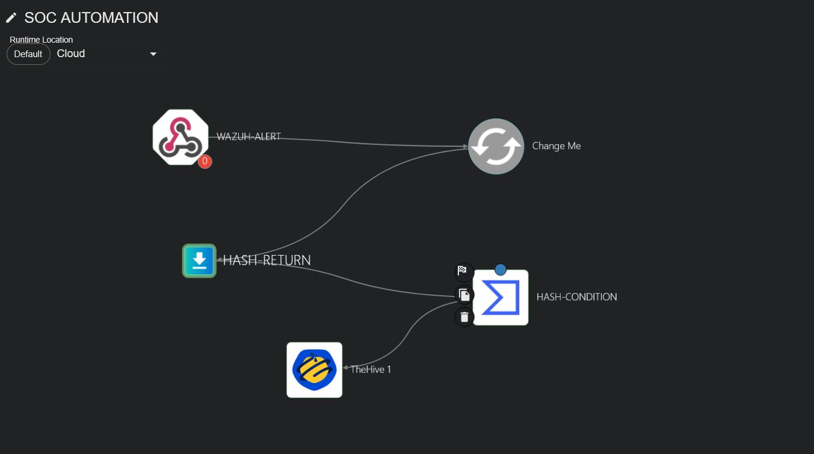
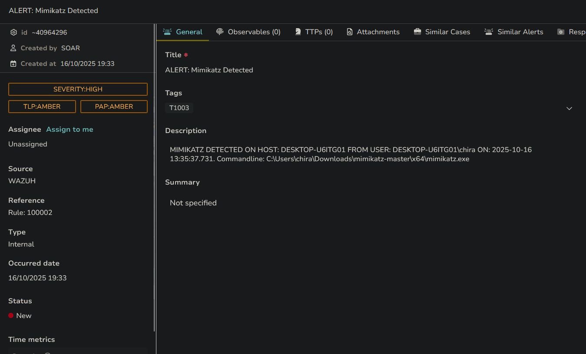

# SOC + SOAR Automation Lab

**End-to-end automated detection, enrichment and case management**

**Stack:** Wazuh (SIEM) · Shuffle (SOAR) · VirusTotal · TheHive · Windows 10 + Sysmon

---

## Overview

A full SOC + SOAR pipeline built from scratch in a homelab, modelled on the
detection-and-response workflow of a real Security Operations Center.

The environment detects a credential theft attempt (Mimikatz), enriches the
alert against VirusTotal, and automatically opens a case in TheHive with
observables and MITRE mapping attached — with no analyst in the loop.

**What it covers:** detection engineering · automation orchestration · threat
intelligence enrichment · incident response workflow design · SIEM + SOAR +
case management integration.



---

## Architecture

### Wazuh — SIEM

Collects telemetry from the Windows agent: Sysmon events, Security logs,
process creation, and command-line arguments. Fires an alert when Mimikatz
execution is detected.

### Shuffle — SOAR

The automation layer. Receives the Wazuh alert via webhook, extracts the file
hash, queries VirusTotal, applies routing logic to classify the result, and
creates a TheHive case with the full observable set.

### VirusTotal — enrichment

File reputation and detection ratio for the binary executed on the endpoint.

### TheHive — case management

Receives the automated case: title, description, severity, MITRE technique
(T1003 — OS Credential Dumping), observables, and timestamps.



---

## Attack simulated

**Credential theft — Mimikatz execution**

| Stage | What happens |
|---|---|
| Execution | Mimikatz runs on the Windows endpoint |
| Telemetry | Sysmon Event ID 1 (process creation) with command line |
| Detection | Wazuh rule matches on process name and signature |
| Enrichment | Shuffle queries VirusTotal for the file hash |
| Case | TheHive case opened, mapped to T1003 — OS Credential Dumping |

---

## What I learned

**Enrichment is not triage.** A VirusTotal detection ratio is a data point, not
a verdict — a handful of low-reputation engines flagging a file is noise as
often as it's signal. Building the pipeline made the boundary between what
automation can decide and what still needs an analyst much sharper for me than
reading about it did.

**Rate limits shape the design.** The VirusTotal public API caps lookups per
minute, so a naive "enrich every indicator in every alert" workflow falls over
under any realistic volume. Deduplication and caching turn out to matter more
than adding a second enrichment source.

**Structured alert data is the whole integration.** SIEM and SOAR only compose
cleanly because the alert carries a predictable schema. Most of the actual
build time went into field mapping, not into the interesting logic.

**Rule tuning is where alert fatigue is won.** Wazuh's default ruleset produced
far more noise than signal on a normal Windows workstation; narrowing to the
events that carry detection value is the difference between a usable pipeline
and one an analyst mutes.

---

## Defensive recommendations

Based on the attack path exercised here:

- Restrict LSASS access — Credential Guard, RunAsPPL
- EDR protections specifically targeting credential dumping
- Monitor high-value Event IDs: 4624 (logon), 4672 (special privileges assigned), 4688 (process creation)
- Application control via AppLocker or WDAC
- MFA and least privilege
- Regular patch cycle for the OS and security subsystems

---

## Limitations

Single Windows endpoint, no domain controller, no network segmentation. One
enrichment source. The workflow has no retry or backoff handling — a failed
VirusTotal call drops the enrichment silently, which is the first thing I'd
fix. Wazuh rules are tuned against one machine's baseline and would need
rework against enterprise volume. Response is detect-and-document only; no
containment actions are wired up.

---

## Future improvements

- Cortex analyzers for deeper enrichment
- MISP threat feed ingestion
- Containment actions — disable user, block IP, isolate host
- Sigma → Wazuh rule generation pipeline

---

## Repo contents

```
├── configs/
│   ├── shuffle-workflow.json    # Shuffle workflow export
│   ├── wazuh-sample-alert.json  # Alert that triggers the pipeline
│   └── virustotal-request.json  # Enrichment request body
├── docs/
│   ├── methodology.md           # How the lab was built, in order
│   ├── soar-logic.md            # Routing and classification logic
│   └── prevention.md            # Defensive controls in depth
└── screenshots/
```

© 2025 Chirayu Paliwal
